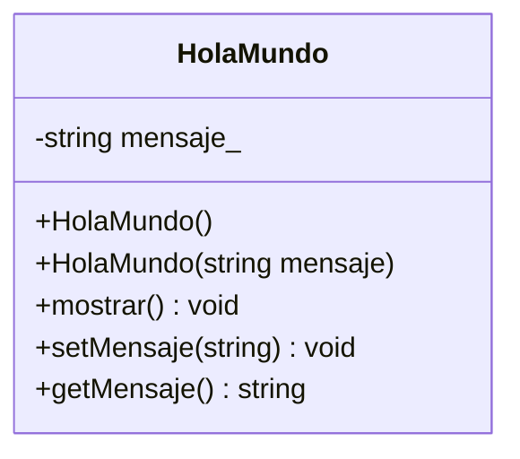

# Practica_01 - Diagrama de Clases UML

## Hola Mundo - Fundamentos de Programación

```mermaid
classDiagram
    class HolaMundo {
        -string mensaje_
        +HolaMundo()
        +HolaMundo(string mensaje)
        +mostrar() void
        +setMensaje(string) void
        +getMensaje() string
    }
```
