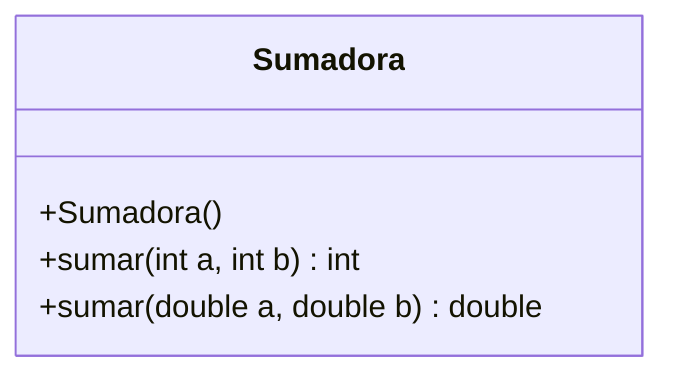

# Practica_02 - Diagrama de Clases UML

## Suma de 2 Números como Parámetros

```mermaid
classDiagram
    class Sumadora {
        +Sumadora()
        +sumar(int a, int b) int
        +sumar(double a, double b) double
    }
```
