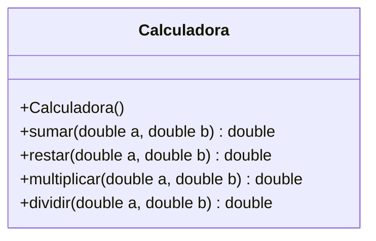

# Practica_03 - Diagrama de Clases UML

## Calculadora Básica

```mermaid
classDiagram
    class Calculadora {
        +Calculadora()
        +sumar(double a, double b) double
        +restar(double a, double b) double
        +multiplicar(double a, double b) double
        +dividir(double a, double b) double
    }
```
