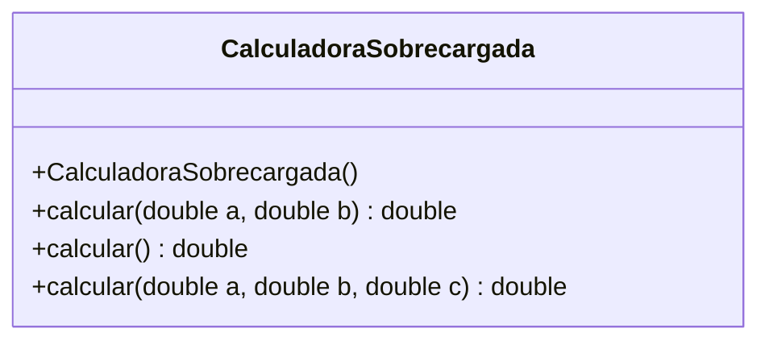

# Practica_04 - Diagrama de Clases UML

## Calculadora con Sobrecarga de Funciones

```mermaid
classDiagram
    class CalculadoraSobrecargada {
        +CalculadoraSobrecargada()
        +calcular(double a, double b) double
        +calcular() double
        +calcular(double a, double b, double c) double
    }
```
