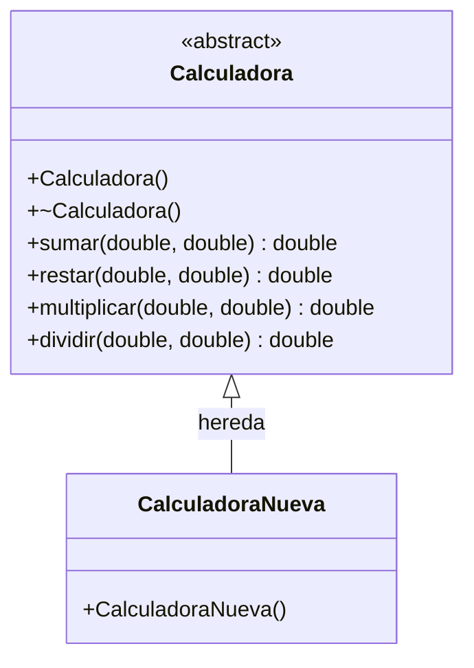

# Practica_05 - Diagrama de Clases UML

## Herencia - Calculadora Nueva

```mermaid
classDiagram
    class Calculadora {
        <<abstract>>
        +Calculadora()
        +~Calculadora()
        +sumar(double, double) double
        +restar(double, double) double
        +multiplicar(double, double) double
        +dividir(double, double) double
    }
    class CalculadoraNueva {
        +CalculadoraNueva()
    }
    Calculadora <|-- CalculadoraNueva : hereda
```
