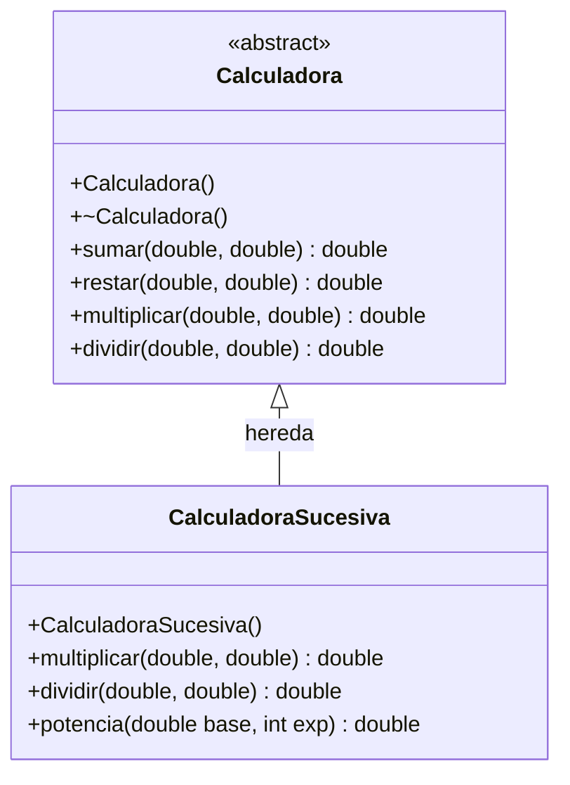

# Practica_06 - Diagrama de Clases UML

## Herencia y Sobrescritura - Calculadora Sucesiva

```mermaid
classDiagram
    class Calculadora {
        <<abstract>>
        +Calculadora()
        +~Calculadora()
        +sumar(double, double) double
        +restar(double, double) double
        +multiplicar(double, double) double
        +dividir(double, double) double
    }
    class CalculadoraSucesiva {
        +CalculadoraSucesiva()
        +multiplicar(double, double) double
        +dividir(double, double) double
        +potencia(double base, int exp) double
    }
    Calculadora <|-- CalculadoraSucesiva : hereda
```
