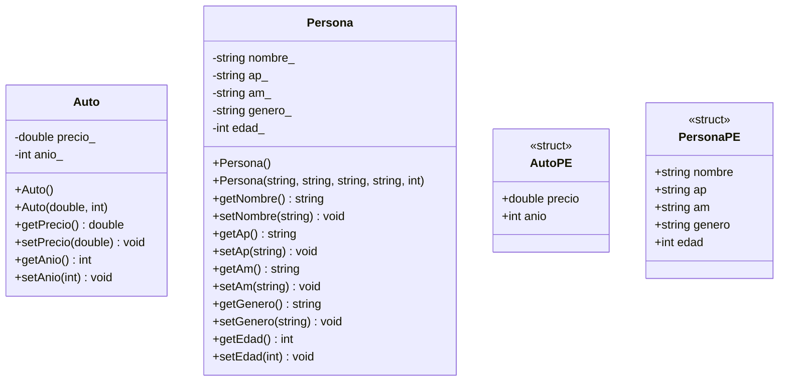

# Practica_07 - Diagrama de Clases UML

## Nuevos Tipos de Dato - Auto y Persona (PE y POO)

```mermaid
classDiagram
    class Auto {
        -double precio_
        -int anio_
        +Auto()
        +Auto(double, int)
        +getPrecio() double
        +setPrecio(double) void
        +getAnio() int
        +setAnio(int) void
    }
    class Persona {
        -string nombre_
        -string ap_
        -string am_
        -string genero_
        -int edad_
        +Persona()
        +Persona(string, string, string, string, int)
        +getNombre() string
        +setNombre(string) void
        +getAp() string
        +setAp(string) void
        +getAm() string
        +setAm(string) void
        +getGenero() string
        +setGenero(string) void
        +getEdad() int
        +setEdad(int) void
    }
    class AutoPE {
        <<struct>>
        +double precio
        +int anio
    }
    class PersonaPE {
        <<struct>>
        +string nombre
        +string ap
        +string am
        +string genero
        +int edad
    }
```
