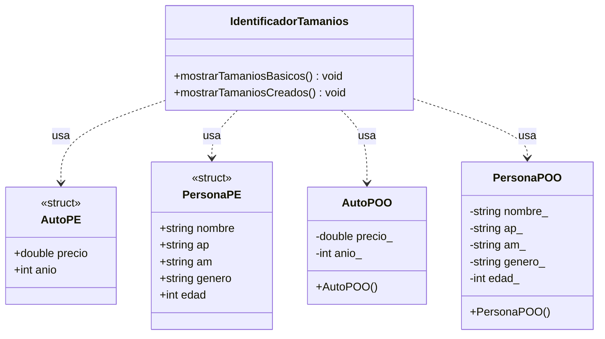

# Practica_08 - Diagrama de Clases UML

## Identificar Tamaños de Tipos (PE y POO)

```mermaid
classDiagram
    class AutoPE {
        <<struct>>
        +double precio
        +int anio
    }
    class PersonaPE {
        <<struct>>
        +string nombre
        +string ap
        +string am
        +string genero
        +int edad
    }
    class AutoPOO {
        -double precio_
        -int anio_
        +AutoPOO()
    }
    class PersonaPOO {
        -string nombre_
        -string ap_
        -string am_
        -string genero_
        -int edad_
        +PersonaPOO()
    }
    class IdentificadorTamanios {
        +mostrarTamaniosBasicos() void
        +mostrarTamaniosCreados() void
    }
    IdentificadorTamanios ..> AutoPE : usa
    IdentificadorTamanios ..> PersonaPE : usa
    IdentificadorTamanios ..> AutoPOO : usa
    IdentificadorTamanios ..> PersonaPOO : usa
```
