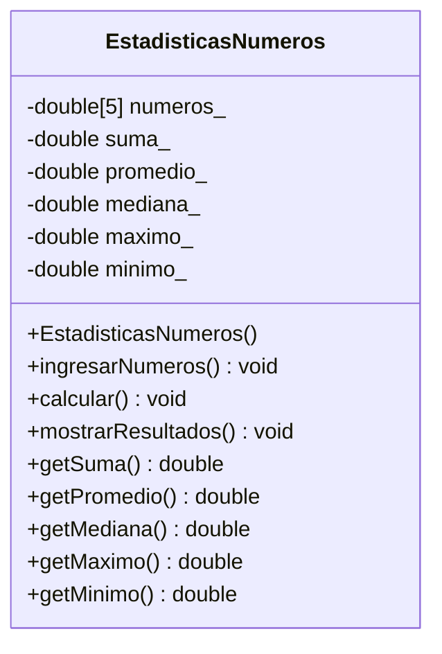

# Practica_09 - Diagrama de Clases UML

## Promedio, Mediana, Máximo, Mínimo, Suma (5 números)

```mermaid
classDiagram
    class EstadisticasNumeros {
        -double[5] numeros_
        -double suma_
        -double promedio_
        -double mediana_
        -double maximo_
        -double minimo_
        +EstadisticasNumeros()
        +ingresarNumeros() void
        +calcular() void
        +mostrarResultados() void
        +getSuma() double
        +getPromedio() double
        +getMediana() double
        +getMaximo() double
        +getMinimo() double
    }
```
