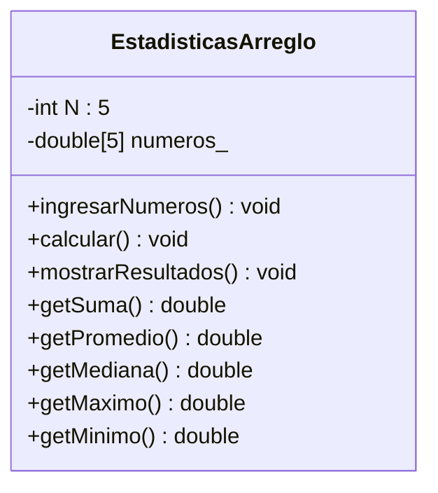

# Practica_10 - Diagrama de Clases UML

## Promedio con Arreglo

```mermaid
classDiagram
    class EstadisticasArreglo {
        -int N : 5
        -double[5] numeros_
        +ingresarNumeros() void
        +calcular() void
        +mostrarResultados() void
        +getSuma() double
        +getPromedio() double
        +getMediana() double
        +getMaximo() double
        +getMinimo() double
    }
```
