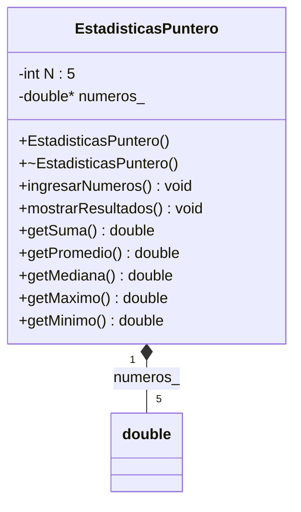

# Practica_11 - Diagrama de Clases UML

## Promedio con Puntero al Arreglo (Acceso Indirecto)

```mermaid
classDiagram
    class EstadisticasPuntero {
        -int N : 5
        -double* numeros_
        +EstadisticasPuntero()
        +~EstadisticasPuntero()
        +ingresarNumeros() void
        +mostrarResultados() void
        +getSuma() double
        +getPromedio() double
        +getMediana() double
        +getMaximo() double
        +getMinimo() double
    }
    EstadisticasPuntero "1" *-- "5" double : numeros_
```
