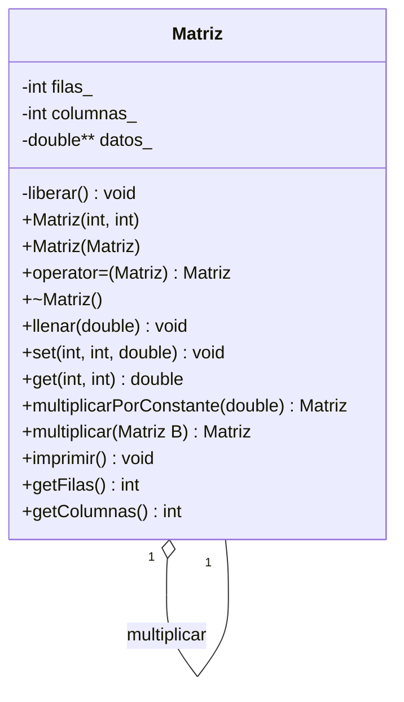

# Practica_12 - Diagrama de Clases UML

## Matrices - A × constante, A × B

```mermaid
classDiagram
    class Matriz {
        -int filas_
        -int columnas_
        -double** datos_
        -liberar() void
        +Matriz(int, int)
        +Matriz(Matriz)
        +operator=(Matriz) Matriz
        +~Matriz()
        +llenar(double) void
        +set(int, int, double) void
        +get(int, int) double
        +multiplicarPorConstante(double) Matriz
        +multiplicar(Matriz B) Matriz
        +imprimir() void
        +getFilas() int
        +getColumnas() int
    }
    Matriz "1" o-- "1" Matriz : multiplicar
```
