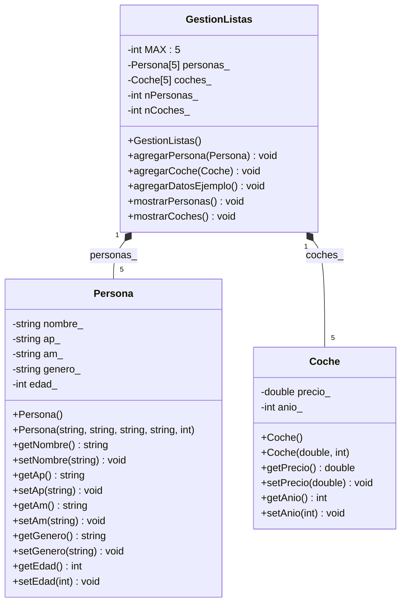

# Practica_13 - Diagrama de Clases UML

## Lista de Personas y Coches (Arreglos)

```mermaid
classDiagram
    class Persona {
        -string nombre_
        -string ap_
        -string am_
        -string genero_
        -int edad_
        +Persona()
        +Persona(string, string, string, string, int)
        +getNombre() string
        +setNombre(string) void
        +getAp() string
        +setAp(string) void
        +getAm() string
        +setAm(string) void
        +getGenero() string
        +setGenero(string) void
        +getEdad() int
        +setEdad(int) void
    }
    class Coche {
        -double precio_
        -int anio_
        +Coche()
        +Coche(double, int)
        +getPrecio() double
        +setPrecio(double) void
        +getAnio() int
        +setAnio(int) void
    }
    class GestionListas {
        -int MAX : 5
        -Persona[5] personas_
        -Coche[5] coches_
        -int nPersonas_
        -int nCoches_
        +GestionListas()
        +agregarPersona(Persona) void
        +agregarCoche(Coche) void
        +agregarDatosEjemplo() void
        +mostrarPersonas() void
        +mostrarCoches() void
    }
    GestionListas "1" *-- "5" Persona : personas_
    GestionListas "1" *-- "5" Coche : coches_
```
