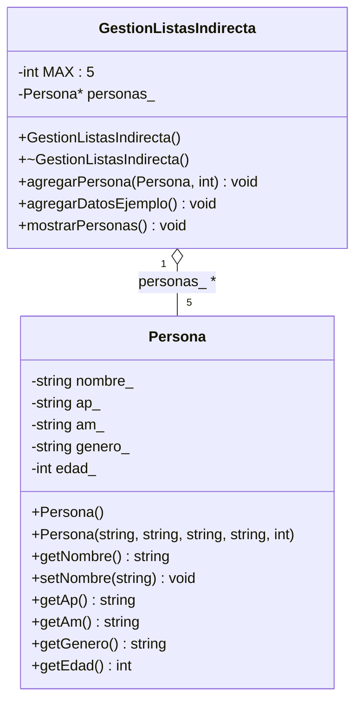

# Practica_14 - Diagrama de Clases UML

## Acceso Indirecto a Lista de Personas

```mermaid
classDiagram
    class Persona {
        -string nombre_
        -string ap_
        -string am_
        -string genero_
        -int edad_
        +Persona()
        +Persona(string, string, string, string, int)
        +getNombre() string
        +setNombre(string) void
        +getAp() string
        +getAm() string
        +getGenero() string
        +getEdad() int
    }
    class GestionListasIndirecta {
        -int MAX : 5
        -Persona* personas_
        +GestionListasIndirecta()
        +~GestionListasIndirecta()
        +agregarPersona(Persona, int) void
        +agregarDatosEjemplo() void
        +mostrarPersonas() void
    }
    GestionListasIndirecta "1" o-- "5" Persona : personas_ *
```
