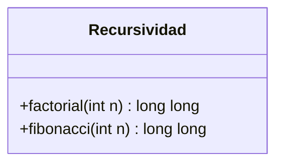

# Practica_15 - Diagrama de Clases UML

## Factorial y Fibonacci Recursivos

```mermaid
classDiagram
    class Recursividad {
        +factorial(int n) long long
        +fibonacci(int n) long long
    }
```
