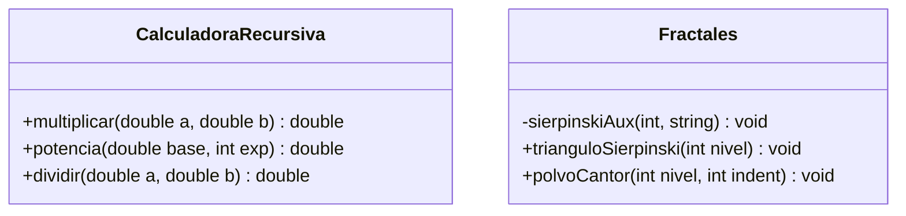

# Practica_16 - Diagrama de Clases UML

## Recursividad - Calculadora y Fractales

```mermaid
classDiagram
    class CalculadoraRecursiva {
        +multiplicar(double a, double b) double
        +potencia(double base, int exp) double
        +dividir(double a, double b) double
    }
    class Fractales {
        -sierpinskiAux(int, string) void
        +trianguloSierpinski(int nivel) void
        +polvoCantor(int nivel, int indent) void
    }
```
