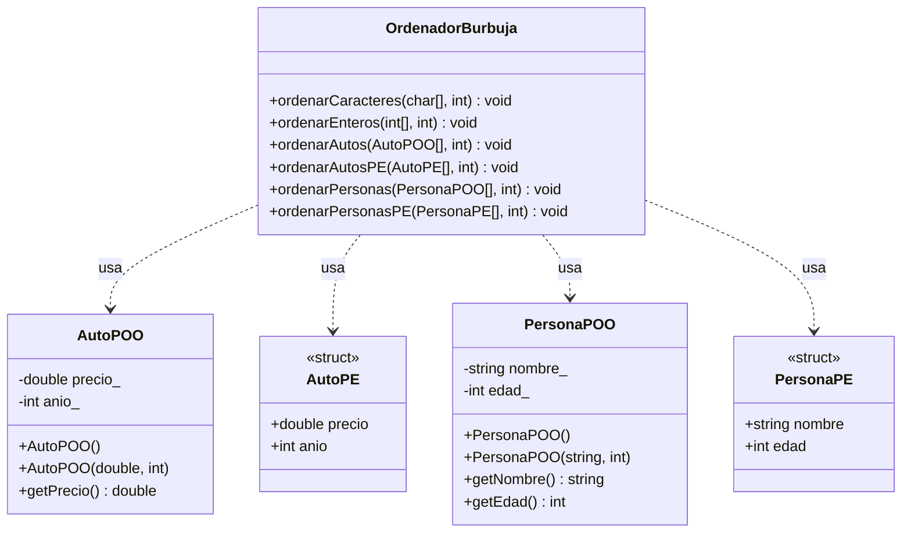

# Practica_17 - Diagrama de Clases UML

## Burbuja - Caracteres, Enteros, Tipos Creados (PE y POO)

```mermaid
classDiagram
    class AutoPE {
        <<struct>>
        +double precio
        +int anio
    }
    class PersonaPE {
        <<struct>>
        +string nombre
        +int edad
    }
    class AutoPOO {
        -double precio_
        -int anio_
        +AutoPOO()
        +AutoPOO(double, int)
        +getPrecio() double
    }
    class PersonaPOO {
        -string nombre_
        -int edad_
        +PersonaPOO()
        +PersonaPOO(string, int)
        +getNombre() string
        +getEdad() int
    }
    class OrdenadorBurbuja {
        +ordenarCaracteres(char[], int) void
        +ordenarEnteros(int[], int) void
        +ordenarAutos(AutoPOO[], int) void
        +ordenarAutosPE(AutoPE[], int) void
        +ordenarPersonas(PersonaPOO[], int) void
        +ordenarPersonasPE(PersonaPE[], int) void
    }
    OrdenadorBurbuja ..> AutoPOO : usa
    OrdenadorBurbuja ..> AutoPE : usa
    OrdenadorBurbuja ..> PersonaPOO : usa
    OrdenadorBurbuja ..> PersonaPE : usa
```
