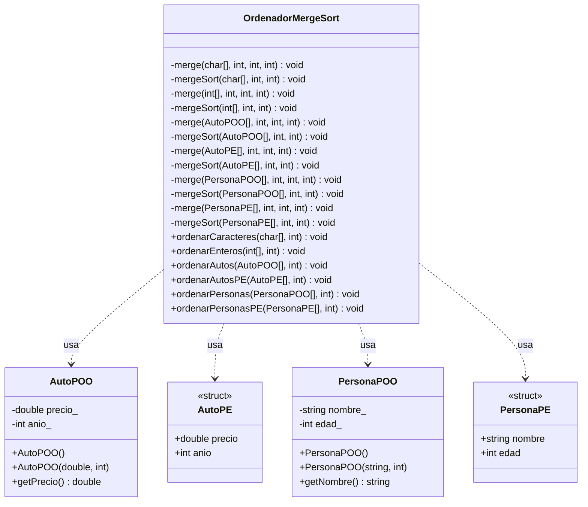

# Practica_18 - Diagrama de Clases UML

## Merge Sort - Caracteres, Enteros, Tipos Creados (PE y POO)

```mermaid
classDiagram
    class AutoPE {
        <<struct>>
        +double precio
        +int anio
    }
    class PersonaPE {
        <<struct>>
        +string nombre
        +int edad
    }
    class AutoPOO {
        -double precio_
        -int anio_
        +AutoPOO()
        +AutoPOO(double, int)
        +getPrecio() double
    }
    class PersonaPOO {
        -string nombre_
        -int edad_
        +PersonaPOO()
        +PersonaPOO(string, int)
        +getNombre() string
    }
    class OrdenadorMergeSort {
        -merge(char[], int, int, int) void
        -mergeSort(char[], int, int) void
        -merge(int[], int, int, int) void
        -mergeSort(int[], int, int) void
        -merge(AutoPOO[], int, int, int) void
        -mergeSort(AutoPOO[], int, int) void
        -merge(AutoPE[], int, int, int) void
        -mergeSort(AutoPE[], int, int) void
        -merge(PersonaPOO[], int, int, int) void
        -mergeSort(PersonaPOO[], int, int) void
        -merge(PersonaPE[], int, int, int) void
        -mergeSort(PersonaPE[], int, int) void
        +ordenarCaracteres(char[], int) void
        +ordenarEnteros(int[], int) void
        +ordenarAutos(AutoPOO[], int) void
        +ordenarAutosPE(AutoPE[], int) void
        +ordenarPersonas(PersonaPOO[], int) void
        +ordenarPersonasPE(PersonaPE[], int) void
    }
    OrdenadorMergeSort ..> AutoPOO : usa
    OrdenadorMergeSort ..> AutoPE : usa
    OrdenadorMergeSort ..> PersonaPOO : usa
    OrdenadorMergeSort ..> PersonaPE : usa
```
