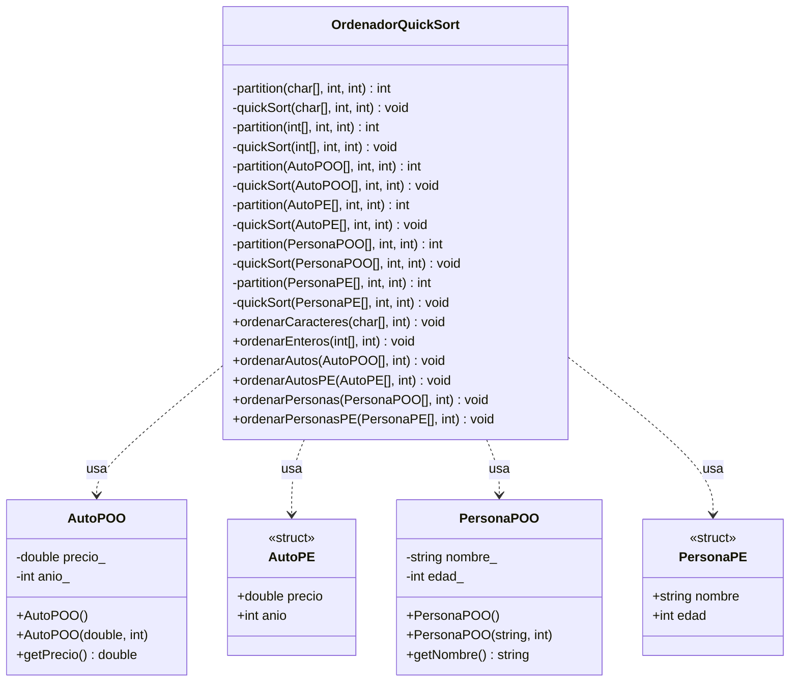

# Practica_19 - Diagrama de Clases UML

## Quick Sort - Caracteres, Enteros, Tipos Creados (PE y POO)

```mermaid
classDiagram
    class AutoPE {
        <<struct>>
        +double precio
        +int anio
    }
    class PersonaPE {
        <<struct>>
        +string nombre
        +int edad
    }
    class AutoPOO {
        -double precio_
        -int anio_
        +AutoPOO()
        +AutoPOO(double, int)
        +getPrecio() double
    }
    class PersonaPOO {
        -string nombre_
        -int edad_
        +PersonaPOO()
        +PersonaPOO(string, int)
        +getNombre() string
    }
    class OrdenadorQuickSort {
        -partition(char[], int, int) int
        -quickSort(char[], int, int) void
        -partition(int[], int, int) int
        -quickSort(int[], int, int) void
        -partition(AutoPOO[], int, int) int
        -quickSort(AutoPOO[], int, int) void
        -partition(AutoPE[], int, int) int
        -quickSort(AutoPE[], int, int) void
        -partition(PersonaPOO[], int, int) int
        -quickSort(PersonaPOO[], int, int) void
        -partition(PersonaPE[], int, int) int
        -quickSort(PersonaPE[], int, int) void
        +ordenarCaracteres(char[], int) void
        +ordenarEnteros(int[], int) void
        +ordenarAutos(AutoPOO[], int) void
        +ordenarAutosPE(AutoPE[], int) void
        +ordenarPersonas(PersonaPOO[], int) void
        +ordenarPersonasPE(PersonaPE[], int) void
    }
    OrdenadorQuickSort ..> AutoPOO : usa
    OrdenadorQuickSort ..> AutoPE : usa
    OrdenadorQuickSort ..> PersonaPOO : usa
    OrdenadorQuickSort ..> PersonaPE : usa
```
