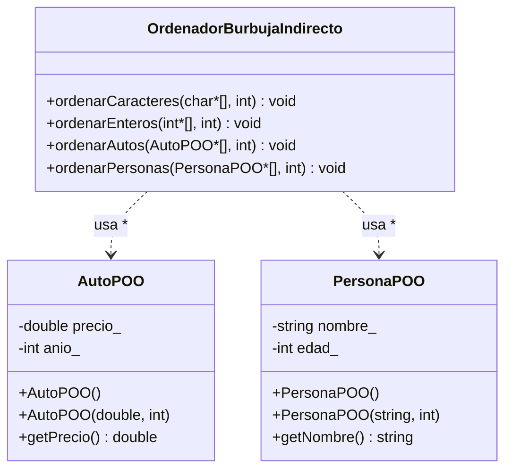

# Practica_20 - Diagrama de Clases UML

## Burbuja Ordenamiento Indirecto (Punteros)

**Python (python/)**: Misma estructura; `ordenar_*` recibe listas de objetos/índices. Sin punteros explícitos; equivalente semántico con referencias.
