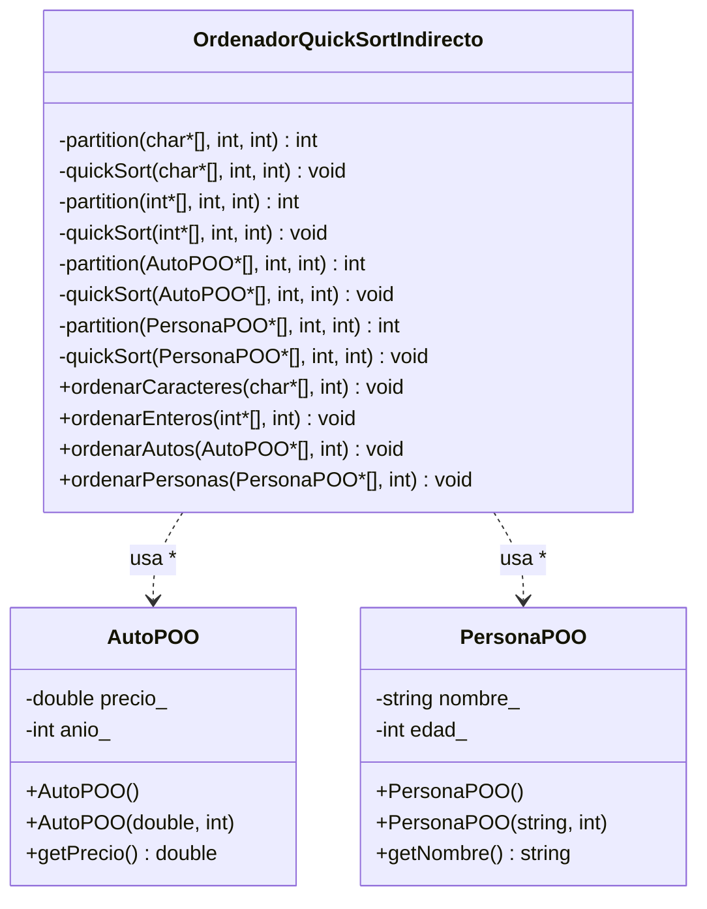

# Practica_22 - Diagrama de Clases UML

## Quick Sort Ordenamiento Indirecto (Punteros)

**Python (python/)**: Misma estructura; ordenamiento indirecto vía listas de referencias o `list.sort(key=...)`.
