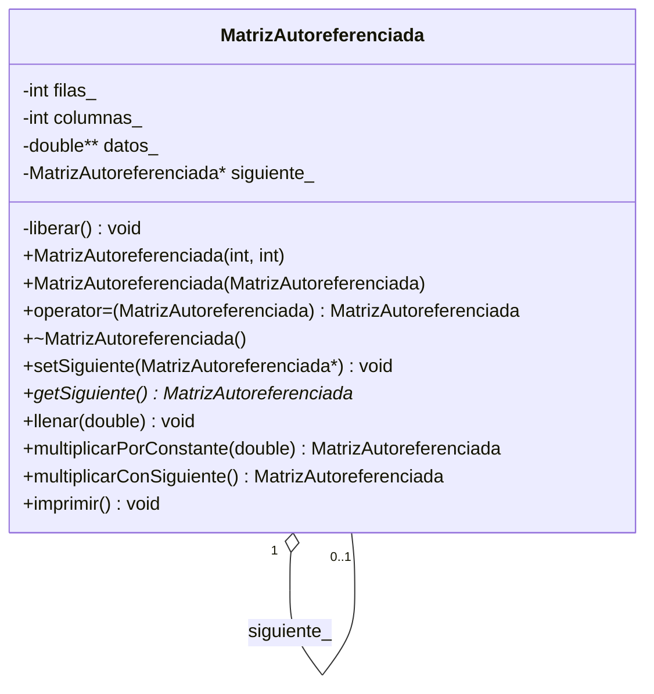

# Practica_23 - Diagrama de Clases UML

## Matriz con Puntero al Mismo Tipo (Autoreferenciada)

**Python (python/)**: `_siguiente: Optional[MatrizAutoreferenciada]`; misma API: `set_siguiente`, `get_siguiente`, `multiplicar_con_siguiente`.
