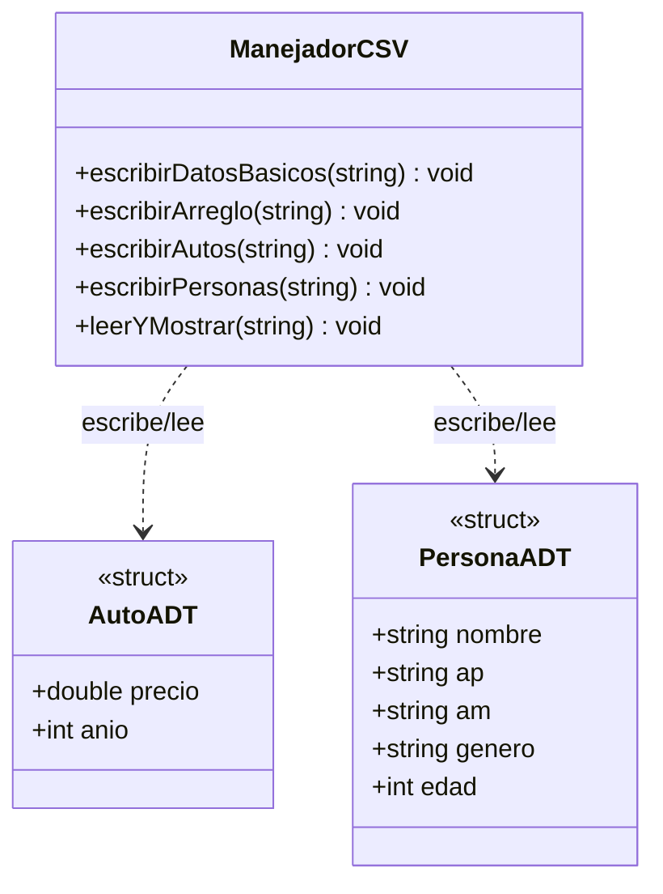

# Practica_24 - Diagrama de Clases UML

## Archivos CSV - Datos Básicos, Arreglos, ADT

**Python (python/)**: `dataclass` para AutoADT/PersonaADT; mismos métodos (`escribir_datos_basicos`, `escribir_arreglo`, etc.).
