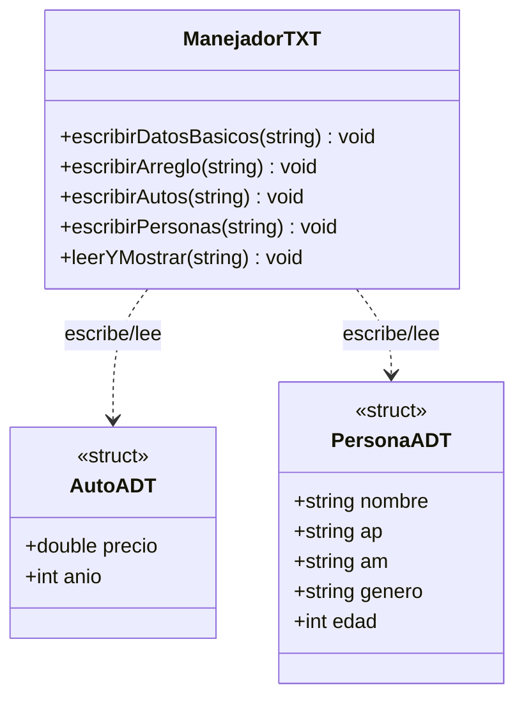

# Practica_26 - Diagrama de Clases UML

## Archivos TXT - Datos Básicos, Arreglos, ADT

```mermaid
classDiagram
    class AutoADT {
        <<struct>>
        +double precio
        +int anio
    }
    class PersonaADT {
        <<struct>>
        +string nombre
        +string ap
        +string am
        +string genero
        +int edad
    }
    class ManejadorTXT {
        +escribirDatosBasicos(string) void
        +escribirArreglo(string) void
        +escribirAutos(string) void
        +escribirPersonas(string) void
        +leerYMostrar(string) void
    }
    ManejadorTXT ..> AutoADT : escribe/lee
    ManejadorTXT ..> PersonaADT : escribe/lee
```

**Python (python/)**: `dataclass` para AutoADT/PersonaADT; mismos métodos; salida TXT idéntica.
